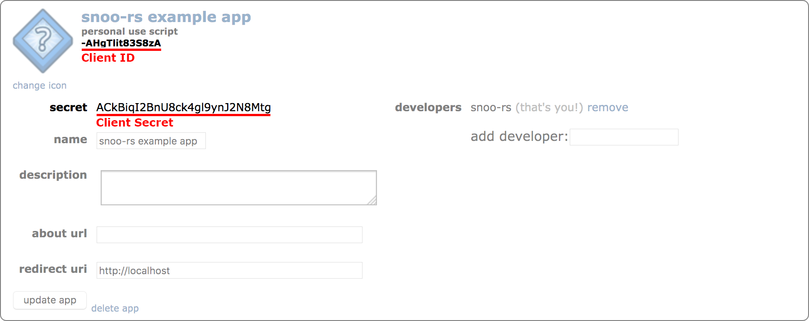

# Basic Example

This example demonstrates how to use `snoo-rs` to get some basic identity information about the authenticated user.

## Setup

Before running this example, you will first need to have a **script** app
registered with Reddit.

### Registering a script app

You can register a new script app with Reddit by following these steps:

1. Go to your [app preferences].
1. At the bottom of the "developed applications" section, click the
   "Create app..." or "Create another app..." button.
1. Enter a name for your app. If the app is just to test this library,
   something like "snoo-rs example app" is fine.
1. Check the "script" radio.
1. Enter "http://localhost" in the "redirect uri" input.
1. Click the "create app" button.

[app preferences]: https://www.reddit.com/prefs/apps/

### Getting the app secrets

Once your app is registered, your app secrets should be visible. If they're
not, you may need to click the "edit" link in the bottom-left of the section
for your new app.

The client ID can be found beneath your app name, and the client secret can be
found next to the "secret" label.



## Usage

To run this example, you will need the following:

1. A client ID (see above)
1. A client secret (see above)
1. The username for the same user who registered the app
1. The password for the same user who registered the app

Run the following command, replacing `xxx` with the appropriate information:

```sh
cargo run --example basic -- --client_id=xxx --client_secret=xxx --username=xxx --password=xxx
```
